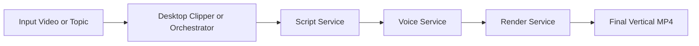
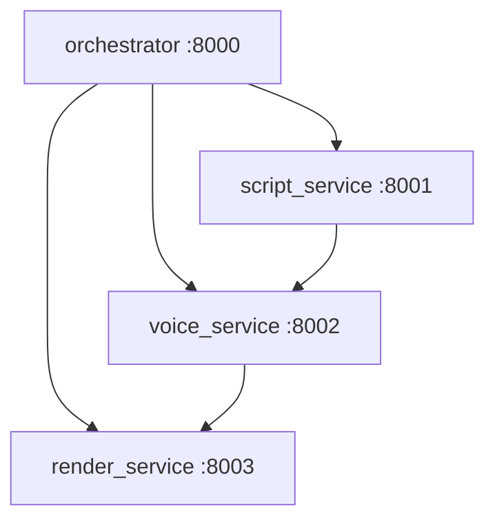

# Clipper CLI


Local-first toolkit for short-form video production.

## Project at a Glance

This repo contains two connected systems:

- `clipper-cli` desktop app (`Electron + React + FFmpeg`): cut clips, auto-split long videos, apply 9:16 presets, add text overlays, generate/burn subtitles with local Whisper.
- `ai-video-factory` microservice pipeline (`FastAPI`): generate script -> synthesize voice -> render vertical video with subtitles (and optional slideshow images).



## Architecture

```text
.
+- core/                    # Node services for clipping + subtitles
+- electron/                # Electron main/preload
+- renderer/                # React UI used by Electron
+- ai-video-factory/        # Python microservices pipeline
+- clipper.js               # CLI clipper script (JSON-config driven)
+- output_clips/            # generated clips (ignored in git)
+- videos/                  # local input videos (ignored in git)
```

## Features

### Desktop clipper

- Local video preview + timeline playhead
- Manual clip export (`start/end`)
- Auto split into equal chunks
- Aspect presets: original and TikTok vertical (`9:16`)
- Optional text overlays (position, size, color, box)
- Local subtitle pipeline:
  - extract WAV with FFmpeg
  - transcribe with local `whisper.cpp`
  - burn SRT into MP4

### AI video factory

- `script_service`: narration + scene structure + visual tags via local Ollama (`llama3`)
- `voice_service`: scene TTS via Piper + merged audio + aligned SRT
- `render_service`: slideshow or solid background + subtitle burn-in
- `orchestrator`: one `POST /generate-video` endpoint for full pipeline



## Prerequisites

### Shared

- `ffmpeg` and `ffprobe` on `PATH`

### Desktop clipper

- Node.js 18+
- npm
- Whisper executable/model configured via env (see [`.env.example`](.env.example))

### AI video factory

- Python 3.10+
- pip
- dependencies from `ai-video-factory/requirements.txt`
- Ollama with `llama3`
- Piper with local voice model
- env values from [`.env.example`](.env.example)

## Quick Start

### 1) Desktop app

```bash
npm install
npm run renderer:build
npm start
```

### 2) AI video factory

```bash
cd ai-video-factory
pip install -r requirements.txt
py run_all.py
```

Services:

- script service: `http://127.0.0.1:8001`
- voice service: `http://127.0.0.1:8002`
- render service: `http://127.0.0.1:8003`
- orchestrator: `http://127.0.0.1:8000`

Example request:

```bash
curl -X POST http://127.0.0.1:8000/generate-video \
  -H "Content-Type: application/json" \
  -d '{
    "topic": "How AI is changing sports training",
    "duration_seconds": 45,
    "tone": "dramatic",
    "language": "en",
    "image_folder": "C:/path/to/images"
  }'
```

## CLI Mode

You can also run direct clip extraction with JSON config:

```bash
node clipper.js path/to/project.json
```

## Legal Disclaimer

`youtube_downloader.py` and related tooling must be used only for content you are legally allowed to download and process.

- You are responsible for complying with applicable copyright law in your jurisdiction.
- You are responsible for complying with platform terms of service (including YouTube Terms).
- Do not use this project to download or redistribute copyrighted content without permission.

If you are publishing content generated with this toolchain, ensure you have rights for all source assets (video, audio, images, voice models, and music).

## Additional Docs

- [AI Video Factory README](ai-video-factory/README.md)
- [Renderer README](renderer/README.md)
- [GitHub Publish Checklist](docs/github-publish-checklist.md)

## License

This project is licensed under the MIT License. See [LICENSE](LICENSE).
